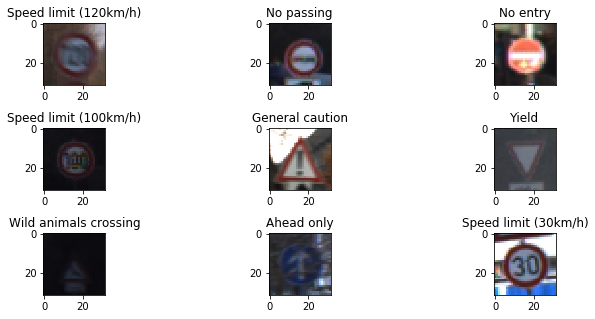
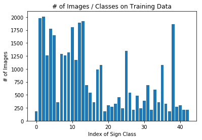
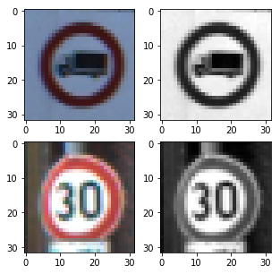
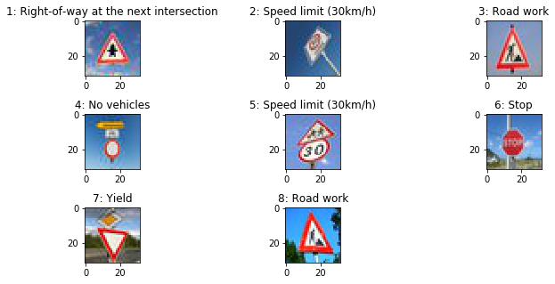
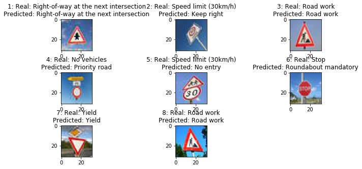
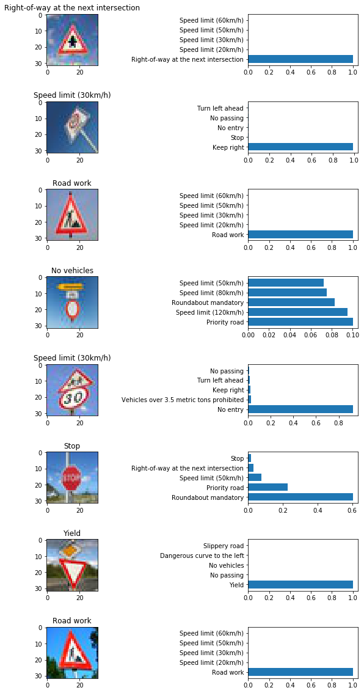

# **Traffic Sign Recognition**

---

**Build a Traffic Sign Recognition Project**

The goals / steps of this project are the following:
* Load the data set (see below for links to the project data set)
* Explore, summarize and visualize the data set
* Design, train and test a model architecture
* Use the model to make predictions on new images
* Analyze the softmax probabilities of the new images
* Summarize the results with a written report


## Image References



---
### Data Set Summary & Exploration

#### 1. Provide a basic summary of the data set. In the code, the analysis should be done using python, numpy and/or pandas methods rather than hardcoding results manually.

I used the numpy library to get summary statistics of the traffic signs data set:

* The size of training set is ?
  * `34799`
* The size of the validation set is ?
  * `4410`
* The size of test set is ?
  * `12630`
* The shape of a traffic sign image is ?
  * 32 by 32
* The number of unique classes/labels in the data set is ?
  * `43`

#### 2. Include an exploratory visualization of the dataset.

Here is an exploratory visualization of the data set. It is a bar chart showing how the data is distributed to each sign class.



### Design and Test a Model Architecture
Firstly, I converted the images to grayscale ones, mainly because there is no duplicated sign of different colors.
I thought I could detect images without color information.

```
def preprocess(x):
  converted = np.zeros((x.shape[0], 32, 32, 1))
  for i in range (0, np.shape(x)[0]):
    # Convert to grayscale
    r, g, b= x[i][:, :, 0], x[i][:, :, 1], x[i][:, :, 2]
    img = 0.2989 * r + 0.5870 * g + 0.1140 * b
    img = img.reshape(32,32,1)
    converted[i] = img
    return  converted
```

Here, I didn't normalize the gray-scaled images, as I tried to train with normalized ones but the training didn't go well.

Here is an example of a traffic sign image before and after preprocessing.




As well as, since the training data is imbalance, I generated another data from the training data by rotating, translating and shearing them.

```
def transform_image(img,ang_range,shear_range,trans_range):
# Rotation
  ang_rot = np.random.uniform(ang_range)-ang_range/2
  rows,cols,ch = img.shape
  Rot_M = cv2.getRotationMatrix2D((cols/2,rows/2),ang_rot,1)

# Translation
  tr_x = trans_range*np.random.uniform()-trans_range/2
  tr_y = trans_range*np.random.uniform()-trans_range/2
  Trans_M = np.float32([[1,0,tr_x],[0,1,tr_y]])

# Shear
  pts1 = np.float32([[5,5],[20,5],[5,20]])

  pt1 = 5+shear_range*np.random.uniform()-shear_range/2
  pt2 = 20+shear_range*np.random.uniform()-shear_range/2

  pts2 = np.float32([[pt1,5],[pt2,pt1],[5,pt2]])

  shear_M = cv2.getAffineTransform(pts1,pts2)

  img = cv2.warpAffine(img,Rot_M,(cols,rows))
  img = cv2.warpAffine(img,Trans_M,(cols,rows))
  img = cv2.warpAffine(img,shear_M,(cols,rows))

  return img
```

By doing so, I made the training data balanced.


#### Network Architecture

My final model consisted of the following layers:

| Layer         		|     Description	        					|
|:---------------------:|:---------------------------------------------:|
| Input         		| 32x32x1 Gray Scale image   							|
| Convolution 3x3     	| 1x1 stride, same padding, outputs 28x28x16 	|
| RELU					|												|
| Max pooling	      	| 2x2 stride,  outputs 14x14x16 				|
| Convolution 3x3     	| 1x1 stride, same padding, outputs 10x10x32 	|
| RELU					|												|
| Max pooling	      	| 2x2 stride,  outputs 5x5x32 				|
| Flatten		| flatten, outputs 800      									|
| Fully connected		| outputs 516          									|
| RELU					|												|
| Dropout					|												|
| Fully connected		| outputs 360        									|
| RELU					|												|
| Dropout					|												|
| Fully connected		| outputs 43 (# of classes)          									|


#### How to Train a Model
3. Describe how you trained your model. The discussion can include the type of optimizer, the batch size, number of epochs and any hyperparameters such as learning rate.

I decided to use `RMSPropOptimizer` as the optimizer to train my model, because I think `RMSPropOptimizer` should be better than Adam, Adagrad and SGD on convolutional neural networks.
The learning rage was `0.001`.

As well as, the batch size was 128 because I can't train one with 256 due to out of memory.
The number of epochs was 30.
It was enough to saturate the validation accuracy during training.

As I mentioned above, my model architecture included dropout layers to avoid overfitting.
That's why I set the keep probability to 0.7.

#### Approach to Find a Solution

Basically, I choosed LeNet architecture to find my solution.
The architecture was not changed very much from the start to the end.

Other than that, I needed to focus on trying better preprocessing methods again and again.
In the beginning, I tried to train a model with RGB color images.
However, the validation accuracy reached the peak around 0.75 or so.
Then, I generated the data from the training data by rotating, translating and shearing them and make them balanced.
After that, I got over 0.8 on the validation accuracy.
Finally, I decided to make the training images grayscale.
I got maximally around 0.94 on the validation accuracy.

I calculated the accuracy of training, validation and test sets at "Analyze Performance on Train, Validation and Test Images".

My final model results were:
* Train Accuracy = 0.924
* Validation Accuracy = 0.942
* Test Accuracy = 0.913

### Test a Model on New Images

Here are five German traffic signs that I found on the web:


These files are under `./downloaded_images`.
I annotated the answers to the downloaded images by my self.
As well as, I resized the images to 32 by 32 pixcels.
In addition, a file name includes its sign class.
For example, `test_image01.14.32x32.jpg` is categorized as the class whose ID is 14.

The second image might be difficult to classify, because the sigh in the image is inclined and the shape of the sign is a rectangle, not round.
In reality, the prediction was wrong.

As well as, the forth, the fifth and the seventh image could be difficult to classify, because those images include multiple signs in each image.


#### Result of Prediction
Here are the results of the prediction:



The model was able to correctly guess 4 of the 8 traffic signs, which gives an accuracy of 50%.
This inferior to the accuracy on the test set of one because I tried to classify difficult images whose include multiple signs in a image.

#### Probability of Prediction



